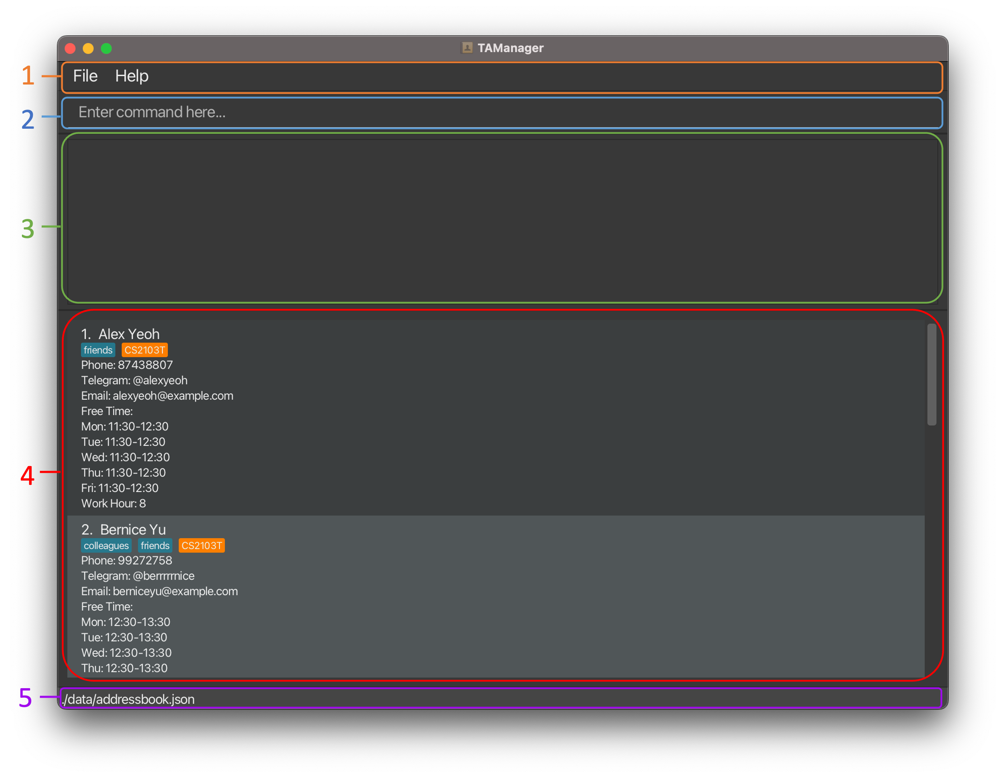
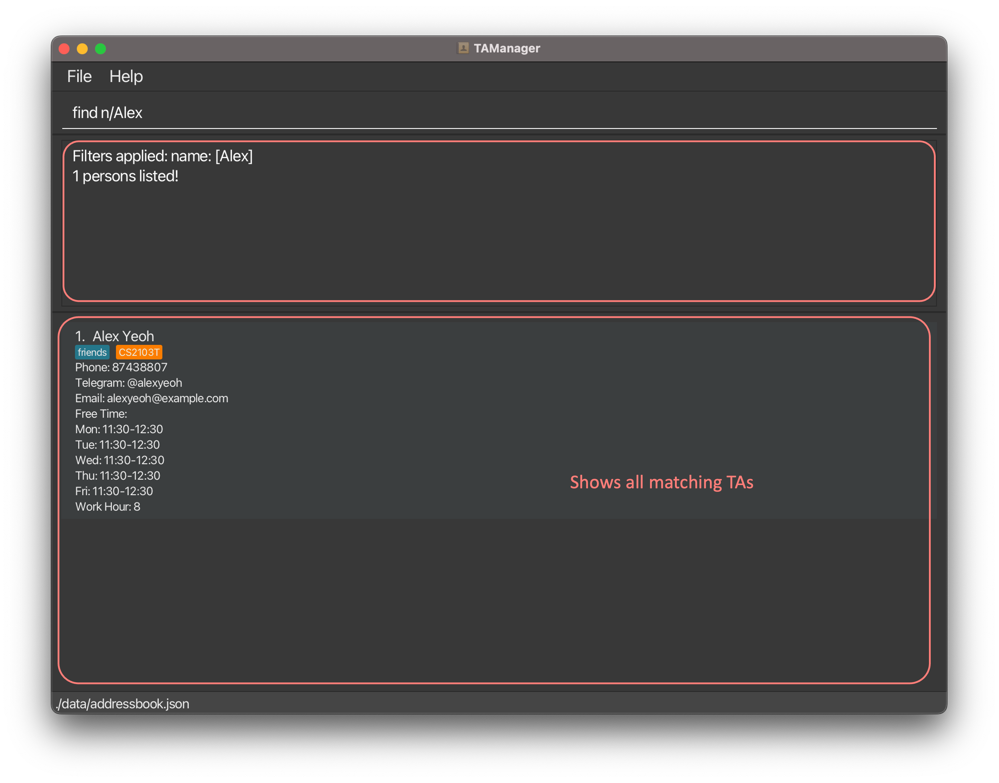
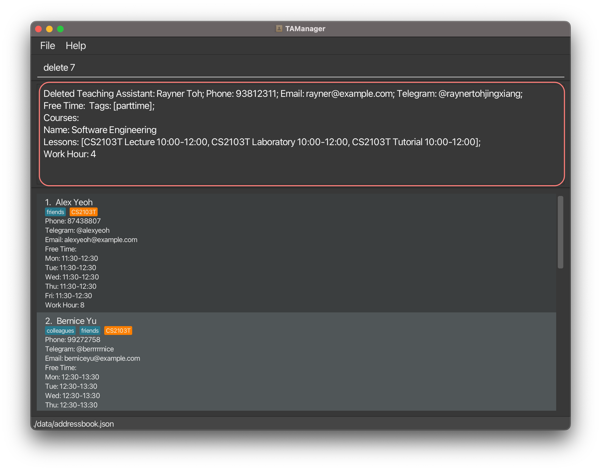
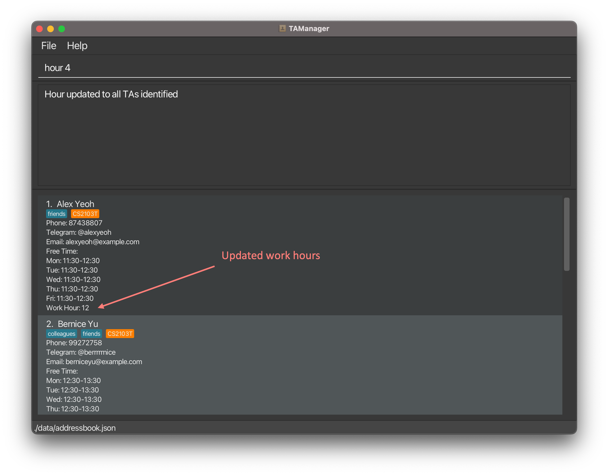
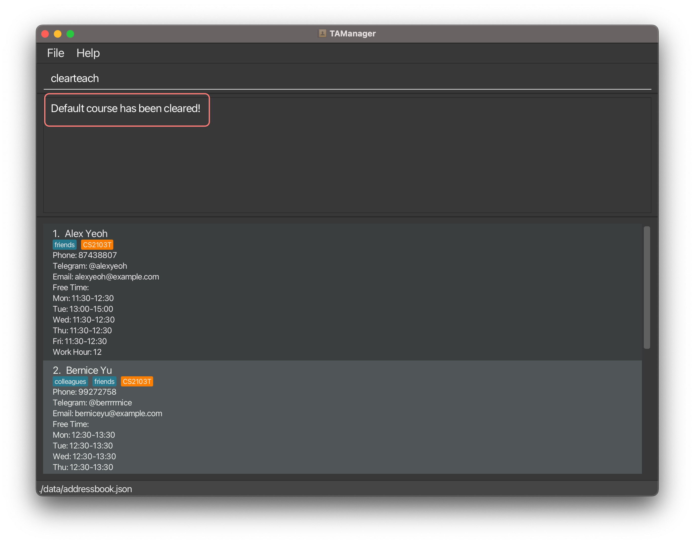

Teaching Assistant Manager (TAManager) is a desktop application for managing teaching assistants (TAs), optimized for use via a Command Line Interface (CLI) while still having the benefits of a Graphical User Interface (GUI). If you can type fast, TAM can help you manage your teaching assistant tasks more efficiently than traditional GUI apps.


### 🌟 Welcome to TAManager - Your Teaching Assistant's Best Friend! 🌟

Are you ready to turbocharge your teaching assistant management experience? Meet TAManager - the desktop application designed to make your life easier, whether you're a seasoned pro or just starting out.

### 🚀 Why TAManager?
TAManager isn't your average app. It's like having a teaching assistant for your teaching assistants! Imagine a tool that's as fast as typing and as intuitive as a friendly chat. That's TAManager for you.

### 💡 Who is it for?
TAManager is crafted with both experienced educators and newbies in mind. If you're someone who types faster than you can click, this is the tool for you! Whether you're managing one assistant or a whole team, TAManager is your go-to solution.


### 🎉 What can TAManager do for you?
- Effortlessly manage teaching assistant tasks
- Navigate tasks with the speed of a command line interface
- Enjoy the perks of a sleek graphical user interface

Ready to revolutionize your teaching assistant game? Let's dive into the world of TAManager and make managing tasks a breeze! 🚀


## Using this Guide

This section will guide you on the various features of TAManager and how to use them.

If you are a new user, we recommend that you read this guide starting from the [Quick Start](#quick-start) section.

If you are an experienced user, you can use the [Table of Contents](#table-of-contents) below to quickly locate the relevant section. Alternatively, you can jump to the [Command Summary](#command-summary) section for an overview of the command syntax.

Throughout our user guide, you will see the following annotations:

| Annotation                         | Meaning                                                                                    |
|------------------------------------|--------------------------------------------------------------------------------------------|
| [Text in blue](javascript: void)   | Clicking on the highlighted text will bring you to the relevant section of the user guide. |
| `Text with light blue background`  | These are commands that you can type into TAManager.                                       |

## Table of Contents
* Table of Contents
{:toc}

---

## Quick Start

1. Ensure you have Java `11` or above installed on your computer.

2. Download the latest `TAManager.jar` from [here](https://github.com/AY2324S1-CS2103T-T10-1/tp/releases).

3. Copy the file to the folder you want to use as the home folder for your Teaching Assistant Manager.

4. Open a command terminal, `cd` into the folder where you placed the jar file, and use the `java -jar TAManager.jar` command to run the application.
   A GUI similar to the one below should appear in a few seconds. Note how the app contains some sample data.
   

5. Type the command in the command box and press Enter to execute it. For example, typing `help` and pressing Enter will open the help window.
   Here are some example commands you can try:

   - `list`: Lists all teaching assistants.
   - `add n/Snowball p/98765432 e/snowball@example.com tele/@snowball t/fulltime c/CS1231S h/10`: Adds a teaching assistant named Snowball to the list.
   - `delete 3`: Deletes the 3rd teaching assistant shown in the current list.
   - `clear`: Deletes all teaching assistants.
   - `exit`: Exits the app.

6. Refer to the following sections below for details on each command.
   1. [TA Management Commands](#ta-management-commands)
   2. [Course Management Commands](#course-management-commands)
   3. [Utility Commands](#utility-commands)


<span style="float:right; font-size: 0.8em;">[BACK TO TOP](#table-of-contents)</span>

--------------------------------------------------------------------------------------------------------------------


## Command Format

<div markdown="block" class="alert alert-info">

**:information_source: Notes about the command format:**<br>

* Words in `UPPER_CASE` are the parameters to be supplied by the user.<br>
  e.g. in `add n/NAME`, `NAME` is a parameter which can be used as `add n/John Doe`.

* Items in square brackets are optional.<br>
  e.g. `n/NAME [t/TAG]` can be used as `n/John Doe t/friend` or as `n/John Doe`.

* Items with `…`​ after them can be used multiple times including zero times.<br>
  e.g. `[t/TAG]…​` can be used as ` ` (i.e. 0 times), `t/friend`, `t/friend t/family` etc.

* Parameters can be in any order.<br>
  e.g. if the command specifies `n/NAME p/PHONE_NUMBER`, `p/PHONE_NUMBER n/NAME` is also acceptable.

* Extraneous parameters for commands that do not take in parameters (such as `help`, `list`, `exit` and `clear`) will be ignored.<br>
  e.g. if the command specifies `help 123`, it will be interpreted as `help`.

* If you are using a PDF version of this document, be careful when copying and pasting commands that span multiple lines as space characters surrounding line-breaks may be omitted when copied over to the application.
</div>

## Understanding Our GUI



1. Menu Bar: Quick access to File and Help features.
2. Command Line: Type your commands here.
3. Command Result: View command results or error messages through here.
4. Teaching Assistant List: View and manage teaching assistants here.
5. Data Storage: Displays the path where your data is stored.

--------------------------------------------------------------------------------------------------------------------

## TA Management Commands

### Adding a Teaching Assistant: `add`

You can add a new teaching assistant to TAManager.

Format: `add n/NAME p/PHONE e/EMAIL tele/TELEGRAM h/HOUR [t/TAG]... [c/COURSE_CODE]...`

- `NAME` should be a string.
- `PHONE` should be a 3-10 digits integer.
- `EMAIL` should contain "@".
- `TELEGRAM` should be between 5-32 characters and start with "@", and it cannot contain any special characters except underscore.
- `HOUR` should be an integer.
- `TAG` should be an alphanumeric string without spaces.
- `COURSE_CODE` should start with 2-3 alphabets, followed by 4 numbers, and optionally end with an alphabet. Needs to be an existing course.

Example:
`add n/ Rayner Toh p/93812311 e/rayner@example.com tele/@raynertjx h/4 t/parttime c/CS2103T` will add a new teaching assistant named Rayner Toh to TAManager.


*<center>TAManager adds a new teaching assistant with the corresponding details.</center>*

<div markdown="block" class="command-succeed">
<div class="alert alert-success">
:heavy_check_mark: When the command succeeds:
</div>
```
New teaching assistant added: Rayner Toh; Phone: 93812311; Email: rayner@example.com; Telegram: @raynertjx;
Free Time:  Tags: [parttime];
Courses:
Name: Software Engineering
Lessons: [CS2103T Lecture 10:00-12:00, CS2103T Tutorial 10:00-12:00, CS2103T Laboratory 10:00-12:00];
Work Hour: 4
```
</div>

<div markdown="block" class="command-fail">
<div class="alert alert-danger">
:x: When the command fails:
</div>

| Error                                                        | Resolution                                                       |
|--------------------------------------------------------------|------------------------------------------------------------------|
| `Invalid command format!`                                    | Ensure that all required parameters are present .                |
| `Course not found.`                                          | Ensure that the `COURSE_CODE` is an existing course.             |
| `This teaching assistant already exists in the address book` | Ensure that the teaching assistant is not already in TAManager.  |
| Invalid parameter                                            | Ensure that input causing the error follows the required format. |

</div>

### Editing a Teaching Assistant: `edit`

You can change the details of a teaching assistant in TAManager.

Format: `edit INDEX [n/NAME] [p/PHONE] [e/EMAIL] [tele/TELEGRAM] [h/HOUR] [t/TAG]... [c/COURSE_CODE]...`

-  At least one field to edit must be provided.
- `NAME` should be a string.
- `PHONE` should be a 3-10 digits integer.
- `EMAIL` should contain "@".
- `TELEGRAM` should be between 5-32 characters and start with "@", and it cannot contain any special characters except underscore.
- `HOUR` should be an integer.
- `TAG` should be an alphanumeric string without spaces.
- `COURSE_CODE` should start with 2-3 alphabets, followed by 4 numbers, and optionally end with an alphabet. Needs to be an existing course.

Example: `edit 7 tele/@raynertohjingxiang`


*<center>TAManager edits the telegram handle of the 7th person in the list.</center>*


<div markdown="block" class="command-succeed">
<div class="alert alert-success">
:heavy_check_mark: When the command succeeds:
</div>
```
Edited Teaching Assistant: Rayner Toh; Phone: 93812311; Email: rayner@example.com; Telegram: @raynertohjingxiang;
Free Time:
Mon: 08:00-12:00
Tue: 08:00-12:00
Wed: 08:00-12:00
Thu: 08:00-12:00
Fri: 08:00-12:00
Tags: [parttime];
Courses:
Name: Software Engineering
Lessons: [CS2103T Lecture 10:00-12:00, CS2103T Tutorial 10:00-12:00, CS2103T Laboratory 10:00-12:00];
Work Hour: 4
```
</div>

<div markdown="block" class="command-fail">
<div class="alert alert-danger">
:x: When the command fails:
</div>

| Error                                                        | Resolution                                                       |
|--------------------------------------------------------------|------------------------------------------------------------------|
| `Invalid command format!`                                    | Ensure that all required parameters are present .                |
| `Course not found.`                                          | Ensure that the `COURSE_CODE` is an existing course.             |
| Invalid parameter                                            | Ensure that input causing the error follows the required format. |

</div>

### Viewing Teaching Assistants: `list`

You can view the list of all teaching assistants in TAManager.

Format: `list`


*<center>TAManager shows you the full list of teaching assistants.</center>*


<div markdown="block" class="command-succeed">
<div class="alert alert-success">
:heavy_check_mark: When the command succeeds:
</div>
```
Listed all teaching assistants
```
</div>

### Finding a Teaching Assistant: `find`

You can find specific teaching assistants using various search parameters.

Format: `find [n/NAME] [c/COURSE_CODE] [d/DAY from/FROM to/TO]`

- You can search by name, course or free time, using the prefixes `n/`, `c/` or `d/ from/ to/` respectively.
- The name prefix `n/` allows for multiple keywords to be used, separated by spaces. e.g. `find n/Alex Bernice` will give you all TAs who have either "Alex" or "Bernice" in their names.
- The course prefix `c/` and free time prefixes `d/ from/ to/` allows for one keyword to be used for each prefix.  e.g. `find c/CS2103T` or `find d/1 from/10:00 to/12:00`.
- To search by the free time field, all three prefixes `d/ from/ to/` must be present and all respective parameters need to be correctly given.
- The search is case-insensitive. e.g. `alex` will match `Alex`, `cs1231s` will match `CS1231S`.
- Only full words will be matched e.g. `Alex` will not match `Alexis`, `cs1231` will not match `cs1231s`.
- You can apply multiple search filters to narrow down the search results, through including multiple filters in
  one command.
- Teaching assistants matching all the search parameters will be returned.
- The search filters are applied to the full list of TAs, not the displayed list of TAs.

Examples:

- `find n/Alex` returns all teaching assistants whose names contain `alex` (e.g. `Alex Yeoh`).
- `find c/cs1231s` returns all teaching assistants that are teaching `cs1231s`.
- `find d/1 from/10:00 to/12:00` returns all teaching assistants that are free on `Monday` from `10:00` to `12:00`.
- `find n/Alex c/cs1231s` returns all teaching assistants whose names contain `alex` and are teaching `cs1231s`.
- `find c/cs2103t d/1 from/10:00 to/12:00` returns all teaching assistants who are teaching `cs2103t` and are free on `Monday` from `10:00` to `12:00`.


*<center>TAManager finds all teaching assistants whose names contain <code>Alex</code>.</center>*

<div markdown="block" class="command-succeed">
<div class="alert alert-success">
:heavy_check_mark: When the command succeeds:
</div>
```
Filters applied: [filters applied by the user]
[number of TAs found] persons listed!
```
</div>

<div markdown="block" class="command-fail">
<div class="alert alert-danger">
:x: When the command fails:
</div>

| Error                     | Resolution                                                                                   |
|---------------------------|----------------------------------------------------------------------------------------------|
| `Invalid command format!` | Ensure that there is at least one prefix provided and parameter provided follows the format. |

</div>

### Removing a Teaching Assistant: `delete`

You can remove a specified teaching assistant from TAManager.

Format: `delete INDEX`

- Deletes the teaching assistant at the specified `INDEX`.
- The index refers to the index number shown in the displayed TA list.
- The index must be a positive integer (1, 2, 3, ...).

Examples:

- [`list`](#viewing-teaching-assistants-list) followed by `delete 2` deletes the 2nd teaching assistant in the address book.
- `find n/Betsy` followed by `delete 1` deletes the 1st teaching assistant in the results of the [`find`](#finding-a-teaching-assistant-find) command.


*<center>TAManager deletes the teaching assistant at the index <code>7</code>.</center>*

<div markdown="block" class="command-succeed">
<div  class="alert alert-success">
:heavy_check_mark: When the command succeeds:
</div>
```
Deleted Teaching Assistant: Rayner Toh; Phone: 93812311; Email: rayner@example.com; Telegram: @raynertohjingxiang;
Free Time:
Mon: 08:00-12:00
Tue: 08:00-12:00
Wed: 08:00-12:00
Thu: 08:00-12:00
Fri: 08:00-12:00
Tags: [parttime];
Courses:
Name: Software Engineering
Lessons: [CS2103T Lecture 10:00-12:00, CS2103T Tutorial 10:00-12:00, CS2103T Laboratory 10:00-12:00];
Work Hour: 4
```
</div>


<div markdown="block" class="command-fail">
<div class="alert alert-danger">
:x: When the command fails:
</div>

| Error                                  | Resolution                                                |
|----------------------------------------|-----------------------------------------------------------|
| `Invalid command format!`              | Ensure that `INDEX` is present and is a positive integer. |
| `The person index provided is invalid` | Ensure that `INDEX` corresponds to a TA in the list       |

</div>

### Updating Hours for Teaching Assistants: `hour`

You can add hours to all teaching assistants in the current list.

Format: `hour HOUR`

- This command updates the hour field for all TAs in the currently displayed list, by adding the `HOUR` value to their current values. This `HOUR` value can be both negative and positive.
- This command can be applied after the [`find`](#finding-a-teaching-assistant-find) command. e.g. First type `find c/ CS2103T` will find all TAs with course
`CS2103T`, then type `hour 6` will add 6 hours to all `CS2103T` TAs only, other TAs will not be updated.
- The resulting working hour after updating should still be within range of 0-9999.

Examples:

- `hour 4` will add 4 hours to all TAs in the address book.
- `find c/CS1231S` then `hour 4` will add 4 hours to all `CS1231S` TAs and other TAs will not be affected.


*<center>TAManager adds the specified number of hours to all teaching assistants.</center>*

<div markdown="block" class="command-succeed">
<div class="alert alert-success">
:heavy_check_mark: When the command succeeds:
</div>
```
Hour updated to all TAs identified!
```
</div>

<div markdown="block" class="command-fail">
<div class="alert alert-danger">
:x: When the command fails:
</div>

| Error                     | Resolution                                              |
|---------------------------|---------------------------------------------------------|
| `Invalid command format!` | Ensure that `HOUR` is present and is between 0 and 9999 |

</div>

### Editing free time of a Teaching Assistant: `editft`

You can edit the free time of a specific teaching assistant on a specified day.

Format: `editft INDEX d/DAY from/FROM to/TO`

- `DAY` should be between 1 and 5, inclusive
- `FROM` and `TO` should be in "HH:mm" format
- `FROM` should be before `TO`

Examples:

- `editft 1 d/2 from/13:00 to/15:00` will update the free time of the TA with index 1 by setting his free time on Tuesday to be 13:00 to 15:00.


*<center>TAManager edits the free time of the teaching assistant at index <code>1</code> on Tuesday to be from <code>13:00</code> to <code>15:00</code>.</center>*

<div markdown="block" class="command-succeed">
<div class="alert alert-success">
:heavy_check_mark: When the command succeeds:
</div>
```
Edited Teaching Assistant: [Details of TA specified]
```
</div>

<div markdown="block" class="command-fail">
<div class="alert alert-danger">
:x: When the command fails:
</div>

| Error                                                             | Resolution                                          |
|-------------------------------------------------------------------|-----------------------------------------------------|
| `Invalid command format!`                                         | Ensure that all prefixes are present                |
| `The person index provided is invalid`                            | Ensure that `INDEX` corresponds to a TA in the list |
| `TA's free time should have a start and end time in HH:mm format` | Ensure that `FROM` and `TO` follow the format       |
| `The start time should be before the end time.`                   | Ensure that `FROM` is before `TO`                   |

</div>

## Course Management Commands

<div markdown="block" class="alert alert-info">

**:information_source: Notes about courses:**<br>
- At the moment, TAManager does not support adding course to the course list.

- Advanced users can edit the course list directly by editing the `courses.json` file.
</div>

### Viewing course information : `course`

You can view the information for a specific course and its tutorial timings.

Format: `course c/COURSE_CODE`

- COURSE_CODE should start with 2-3 alphabets, followed by 4 numbers, and optionally end with an alphabet. Needs to be an existing course.

Example: `course c/CS2103T` returns the course information and tutorial timings for CS2103T.


*<center>TAManager displays the information for the specified course.</center>*

<div markdown="block" class="command-succeed">
<div class="alert alert-success">
:heavy_check_mark: When the command succeeds:
</div>
```
Course: CS2103T Software Engineering
CS2103T Lecture 10:00-12:00
CS2103T Tutorial 10:00-12:00
CS2103T Laboratory 10:00-12:00
```
</div>

<div markdown="block" class="command-fail">
<div class="alert alert-danger">
:x: When the command fails:
</div>

| Error                                                                                                       | Resolution                                      |
|-------------------------------------------------------------------------------------------------------------|-------------------------------------------------|
| `Invalid command format!`                                                                                   | Ensure that prefix `c/` is present              |
| `Course codes should start with 2-3 alphabets, followed by 4 numbers, and optionally end with an alphabet.` | Ensure that `COURSE_CODE` follows the format    |
| `Course not found.`                                                                                         | Ensure that `COURSE_CODE` is an existing course |

</div>

### Adding a default course : `teach`

You can add a default course to TAManager. The default course is the course that you are currently managing or teaching. This is useful when you only want to view TAs that are teaching your default course.

Format: `teach c/COURSE_CODE`

- COURSE_CODE should start with 2-3 alphabets, followed by 4 numbers, and optionally end with an alphabet. Needs to be an existing course.

Expected outcome:
- Updates the name of the window with the default course.
- Filters the list of TAs teaching under the course automatically.
- The default course is saved even after you close the application.
- The next time you open the application, the list of TAs will be automatically filtered based on your default course.

Example: `teach c/CS2103T` sets the default course to the course CS2103T.


*<center>TAManager successfully added the default course.</center>*

<div markdown="block" class="command-succeed">
<div class="alert alert-success">
:heavy_check_mark: When the command succeeds:
</div>
```
CS2103T is successfully added as default course.
```
</div>

<div markdown="block" class="command-fail">
<div class="alert alert-danger">
:x: When the command fails:
</div>

| Error                                                                                                       | Resolution                                      |
|-------------------------------------------------------------------------------------------------------------|-------------------------------------------------|
| `Invalid command format!`                                                                                   | Ensure that prefix `c/` is present              |
| `Course codes should start with 2-3 alphabets, followed by 4 numbers, and optionally end with an alphabet.` | Ensure that `COURSE_CODE` follows the format    |
| `Course not found.`                                                                                         | Ensure that `COURSE_CODE` is an existing course |

</div>

### Reset the default course : `clearteach`

You can reset the default course in TAManager.

This will revert the changes made by the [`teach`](#adding-a-default-course--teach) command.

If no default course is set, the command will execute successfully but nothing will happen.

Example: `clearteach`


*<center>TAManager successfully reset the default course.</center>*

<div class="command-succeed">
<div markdown="block" class="alert alert-success">
:heavy_check_mark: When the command succeeds:
</div>
<div markdown="block" class="code">
```
Default course has been cleared!
```
</div>
</div>

## Utility Commands

### Viewing help : `help`

You can access the link to access this user guide if you need it.

Format: `help`


<div class="command-succeed">
<div markdown="block" class="alert alert-success">
:heavy_check_mark: When the command succeeds:
</div>
<div markdown="block" class="code">
```
Opened help window.
```
</div>
</div>

### Clearing all entries : `clear`

You can clear all entries from TAManager.

<div markdown="block" class="alert alert-warning">
**:exclamation: Caution:**This is a dangerous command that will delete all TA data and is irreversible. Please ensure that you have backed up your data.
</div>

Format: `clear`

<div class="command-succeed">
<div markdown="block" class="alert alert-success">
:heavy_check_mark: When the command succeeds:
</div>
<div markdown="block" class="code">
```
Address book has been cleared!
```
</div>
</div>

### Exiting the program : `exit`

You can safely exit the program.

Format: `exit`

## Saving your data

TAManager data is saved in the hard disk automatically after any command that changes the data. There is no need for you to save manually.

## Editing the data file

TAManager data are saved automatically as a JSON file `[JAR file location]/data/addressbook.json`. Advanced users are welcome to update data directly by editing that data file.


<div markdown="span" class="alert alert-warning">:exclamation: **Caution:**
If your changes to the data file makes its format invalid, TAManager will discard all data and start with an empty data file at the next run. Hence, it is recommended to make a backup of the file before editing it.
</div>

<span style="float:right; font-size: 0.8em;">[BACK TO TOP](#table-of-contents)</span>

--------------------------------------------------------------------------------------------------------------------

## Frequently Asked Questions

**Q**: How do I transfer my data to another computer?<br>
**A**: Install the app in your other computer and overwrite the empty data file it creates with the file that contains the data of your previous TAManager.

--------------------------------------------------------------------------------------------------------------------

## Command summary
Commands are arranged in alphabetical order for your easy reference.

| Action                                                          | Format, Examples                                                                                                                                                                                           |
|-----------------------------------------------------------------|------------------------------------------------------------------------------------------------------------------------------------------------------------------------------------------------------------|
| **[Add](#adding-a-teaching-assistant-add)**                     | `add n/NAME p/PHONE e/EMAIL tele/TELEGRAM [t/TAG]... [c/COURSE_CODE]... h/HOUR` <br> e.g. `add n/Snowball p/98765432 e/snowball@example.com tele/@snowball from/10:00 to/12:00 t/fulltime c/CS1231S h/10`  |
| **[Clear](#clearing-all-entries--clear)**                       | `clear`                                                                                                                                                                                                    |
| **[ClearTeach](#reset-the-default-course--clearteach)**         | `clearteach`                                                                                                                                                                                               |
| **[Course](#viewing-course-information--course)**               | `course c/[COURSE_CODE]`<br> e.g. `course c/CS2103T`                                                                                                                                                       |
| **[Delete](#removing-a-teaching-assistant-delete)**             | `delete INDEX`<br> e.g. `delete 3`                                                                                                                                                                         |
| **[Edit](#editing-a-teaching-assistant-edit)**                  | `add n/NAME p/PHONE e/EMAIL tele/TELEGRAM [t/TAG]... [c/COURSE_CODE]... h/HOUR` <br> e.g. `edit n/Snowball p/98765432 e/snowball@example.com tele/@snowball from/10:00 to/12:00 t/fulltime c/CS1231S h/10` |
| **[Editft](#editing-free-time-of-a-teaching-assistant-editft)** | `editft INDEX d/DAY from/FROM to/FROM` <br> e.g. `editft 1 d/2 from/12:30 to/13:30`                                                                                                                        |
| **[Exit](#exiting-the-program--exit)**                          | `exit`                                                                                                                                                                                                     |
| **[Find](#finding-a-teaching-assistant-find)**                  | `find PREFIX KEYWORD [MORE_KEYWORDS]`<br> e.g. `find n/Alex`, `find c/cs1231s`, `find from/10:00 to/12:00`, `find n/Alex c/cs1231s`, `find c/cs2103t from/10:00 to/12:00`                                  |
| **[Help](#viewing-help--help)**                                 | `help`                                                                                                                                                                                                     |
| **[Hour](#updating-hours-for-teaching-assistants-hour)**        | `hour INTEGER`<br> e.g., `hour 2`                                                                                                                                                                          |
| **[List](#viewing-teaching-assistants-list)**                   | `list`                                                                                                                                                                                                     |
| **[Teach](#adding-a-default-course--teach)**                    | `teach c/[COURSE_CODE]`<br> e.g. `teach c/CS2103T`                                                                                                                                                         |

<span style="float:right; font-size: 0.8em;">[BACK TO TOP](#table-of-contents)</span>
